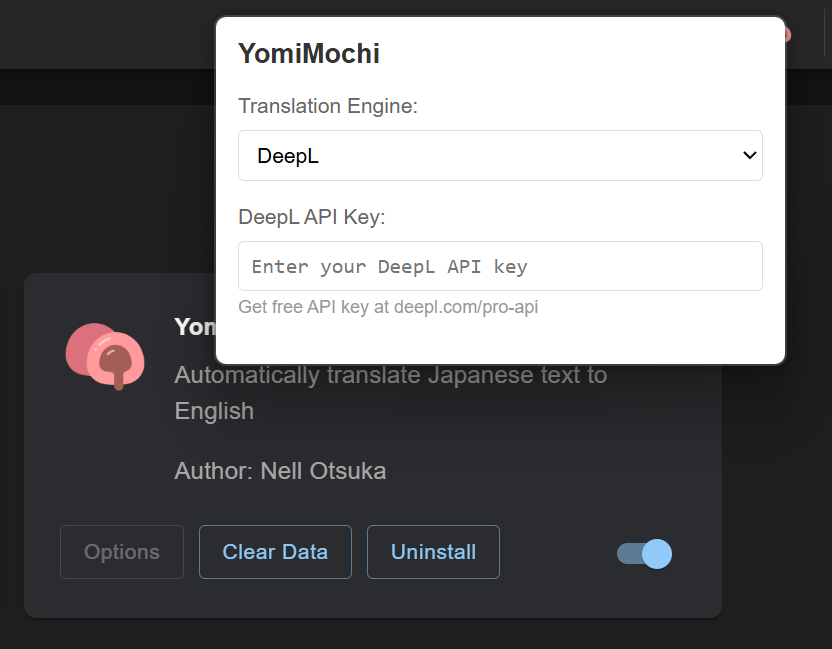

# YomiMochi

An extension for [YomiNinja](https://github.com/matt-m-o/YomiNinja) that automatically translates OCR-extracted Japanese text to English using DeepL or Google Translate.

## Demo


<sub>Boundary Gate —Daughter of Kingdom—</sub>

## Installation

1. Download the latest `yomimochi.zip` from [Releases](https://github.com/nell-otsuka/YomiMochi/releases)
2. In YomiNinja, go to the Extensions tab
3. Click "Install ZIP" and select the downloaded ZIP file

**Or build it yourself:**
```bash
.\make-zip.bat
```

## Setup



1. Click the extension icon
2. Choose your translation engine (DeepL or Google Translate)
3. If using DeepL, enter your API key from [deepl.com/pro-api](https://www.deepl.com/pro-api) (only tested with free API keys)

## Usage

Once installed and enabled, the extension automatically translates Japanese text that YomiNinja extracts. No additional actions needed.

## File Structure

```
yomimochi/
├── manifest.json       # Extension configuration
├── background.js       # Handles API calls (DeepL/Google)
├── content.js          # Monitors YomiNinja overlays
├── popup.html          # Settings UI
├── popup.js            # Settings logic
└── make-zip.bat        # Build script
```

## Troubleshooting

**Translation quality issues?**
- All translations are machine-generated and may not be perfect
- Results can vary depending on context and sentence structure

**DeepL API errors?**
- Make sure you've entered your DeepL API key in the extension settings
- Check if you've exceeded your monthly quota (500,000 characters for free tier)

**Google Translate errors?**
- Uses an unofficial endpoint that Google may rate-limit or block
- Try switching to DeepL

## Credits

Icon by Rikas Dzihab from [Flaticon](https://www.flaticon.com/)

## License

MIT
